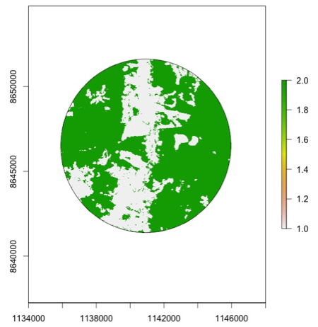
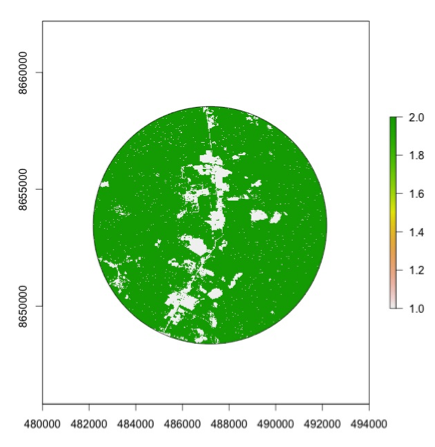

# Working with raster maps 
***

## Load Maps

First, set a folder where you will have shapefiles and images

```{r}
setwd("~/Documents/PhD.Dissertation/Campo2017/Maps&Imagenes/Bosque_No_Bosque_2016_Hib_Raster") 
```


#### you will need:
1. intermediate knowledge of R
2. the following packages:

```{r}
library(raster)
library(SDMTools) 
library(maptools) 
library(rgdal) 
```

## Uploading raster files

```{r}
Forest <- raster("Bosque_No_bosque_2016.tif") 
```

To know the projection of the raster

```{r}
projection(Forest)
```

To know the resolution of the raster

```{r}
res(Forest) 
```

To plot the raster, in this case this is for whole country

```{r}
plot(Forest)
```

## Croping maps
***
Croping the country raster in order to have only the Madre de Dios department

First we generate an object using the UTM coordinates that delimited the study area

```{r}
CorridorMap = extent(1050000, 1190000, 8550000, 8900000) 
```

The function "extent" returns an Extent object of the Raster

We use this object to crop the country raster into a small area

```{r}
cropForest <- crop(Forest, CorridorMap) 
```

We then plot the small raster

```{r}
plot(cropForest)
```

In order to know how many class categories the raster has we use the function "ClassStat".

The function "ClassStat" calculates the class statistics for patch types identified in a raster.

```{r}
class<-ClassStat(cropForest)
```

In the example there are 4 classes: 1 - non-forest 2000, 2 - forest 2016, 3 - hydrography, 4 - forest loss 2001-2016

## Reclassification
***
We want to reclassify the raster changing 1 (non-forest 2000), 3 (hydrography), 4 (forest loss 2001-2016) = Non Forest 

We create a table with the old and new classes.

```{r}
classification<-matrix(NA, 4,4)
classification[,1]<-c(1,2,3,4)
classification[,2]<-c("NoForest2000","Forest2016","Hidrography","Loss2001-2016")
classification[,3]<-c(1,2,1,1)
classification[,4]<-c("NoForest","Forest","NoForest","NoForest")
colnames(classification)<-c("Landcover","Description","ChangeTo", "Description2")
classification<-as.data.frame(classification) 
str(classification)
classification[,1]<-as.numeric(classification[,1])
classification[,3]<-as.numeric(classification[,3])
class<-classification[,c(1,3)]
str(class)
```

### Reclassify the map

The function "reclassify" (re)classifies groups of values to other values. 

```{r}
rasterFINAL<-reclassify(cropForest,rcl=class)
```

Ploting the reclassified raster

```{r}
plot(rasterFINAL)
```

Getting the metrics from reclassified raster
```{r}
class2<-ClassStat(rasterFINAL) 
```

Total area for class 1: 2996706
Total area for class 2: 23683464

But this needs to be multiplied by the area of each cell: 30x30m = 900 m2

```{r}
area1<-2996706*900
area2<-23683464*900
```

We want the green to be 1 and white to be 0. 
Changing the legend values from 1-2, to 0-1

```{r}
forest<-rasterFINAL
values(forest)<-0 
forest[rasterFINAL==2]<-1
rasterFINAL<-forest
plot(rasterFINAL)
```

## Estimating Forest Cover in specific areas
***

#### Croping raster using shape files 

To draw a polygon from a shape file in R, we use as example shape file for a circle of 5km radius surrounding a sampling site in Madre de Dios, Peru

```{r}
Site3.5km = readShapeSpatial("Site3-5km.shp") 
```

To know if the projection of the polygon is the same of the raster map

```{r}
projection(Site3.5km) 
```

The shape file does not have any projection

To fix this,we first adjust the coordinate system.
Since the shape file was generate under longitude and latitude coordinate system we use that one. We indicate the datum too.

```{r}
Site3.5km = readShapePoly("Site3-5km.shp", proj4string=CRS("+proj=longlat +datum=WGS84"))
```

Note that if  we assign UTM directly, the longitude and latitude coordinates from the shape file will wrongly be considered as UTM.

Check which projection is showing now

```{r}
projection(Site3.5km) 
```

In order to have an exact correspondence between the polygon and the raster map, we assigned the coordinate system and projection from the raster to the polygon.

```{r}
spgeo <- spTransform(Site3.5km,CRS("+proj=utm +zone=18 +south +datum=WGS84 +units=m +no_defs +ellps=WGS84 +towgs84=0,0,0")) 
```

To be sure that the projection is correct

```{r}
projection(spgeo) 
```

We can plot just the polygon to be sure the axes of coordinates are correct

```{r}
plot(spgeo, axes=T) 
```

To plot the raster with the polygon 

First we plot the raster

```{r}
plot(rasterFINAL)
```

Add the polygon to the raster

```{r}
plot(spgeo, add = T, border="black")
```

To have a better visualization of the area, we crop the map to a smaller extent creating an object of similar extension to the polygon

```{r}
section = extent(1134000, 1148000, 8640000, 8652000) 
cropMap <- crop(rasterFINAL, section) 
plot(cropMap)
```

To crop and plot the raster in the shape of the polygon

```{r}
rr <- mask(cropMap,spgeo)
plot(rr)
plot(spgeo,add=TRUE)
```
For changing the legend values from 1-2, to 0-1

```{r}
forest<-rr
values(forest)<-0 
forest[rr==2]<-1
rr<-forest
plot(rr)
```



### Total area estimation

To calculate the statistics we need to transform the raster values to matrix type 

```{r}
as.matrix(table(values(rr))) 
```

```{r}
classSite3.5km<-ClassStat(rr)
```

"total.area" shows the sum of the areas (m2) of all patches of the corresponding patch type.
Total forest area: 60765

But we need to multiply it by the size of each cell: 900m2

```{r}
forestarea<-60765*900
```
Result: 54688500m2 or 54.69km2


# Working with NDVI 
***

Setting the folder

```{r}
setwd("~/Documents/PhD.Dissertation/Campo2017/Maps&Imagenes/Bosque_No_Bosque_2016_Hib_Raster") 
```

Load NDVI

```{r}
NDVI <- raster("~/Documents/PhD.Dissertation/Campo2017/Maps&Imagenes/NDVI_20160719.tif")
```

To know the projection of the raster

```{r}
projection(NDVI)
```

To know the resolution of the raster

```{r}
res(NDVI) 
```
In this case is 5 by 5 meters

To plot the raster

```{r}
plot(NDVI) 
```

To convert the values into a table

```{r}
as.matrix(table(values(NDVI))) 
```

## Reclassify the map
***

Having good knowledge of the area, I defined which classes correspond to forest and to not forest 

We create a table with the old classes and the new classes.

```{r}
classification<-matrix(NA, 256,4)
classification[,1]<-c(0:255)
classification[,2]<-c(rep("NN",256))
classification[,3]<-c(rep(3,4), rep(1,115), rep(2,137))
classification[,4]<-c(rep("NoData",4), rep("NoForest",115), rep("Forest",137))
colnames(classification)<-c("Landcover","Description","ChangeTo", "Description2")
classification<-as.data.frame(classification) 
str(classification)
classification[,1]<-as.numeric(as.character(classification[,1]))
classification[,3]<-as.numeric(classification[,3])
class<-classification[,c(1,3)]
str(class)
```

The function "reclassify" (re)classifies groups of values to other values. 

```{r}
rasterFINAL<-reclassify(NDVI,rcl=class)
```

Ploting the reclassified raster

```{r}
plot(rasterFINAL)
```

To know the projection of the reclassified raster

```{r}
projection(rasterFINAL)
```

## Estimating Forest Cover in a determined area
***

Repeating the example to estimate the forest cover in a circle of 5km radius surrounding a sampling site.

SITE 3 - 5KM Radii

```{r}
Site.5km = readShapeSpatial("Site3-5km.shp")
projection(Site.5km) 
Site.5km = readShapePoly("Site3-5km.shp", proj4string=CRS("+proj=longlat +datum=WGS84"))
projection(Site.5km)
spgeo <- spTransform(Site.5km,CRS("+proj=utm +zone=19 +south +datum=WGS84 +units=m +no_defs +ellps=WGS84 +towgs84=0,0,0"))
projection(spgeo) 
plot(spgeo, axes=T) 
CorridorMap = extent(480000, 493000, 8648000, 8660000) 
cropSite <- crop(rasterFINAL, CorridorMap) 
plot(cropSite) 
plot(spgeo, add = T, border="black") 
rr <- mask(cropSite,spgeo)
plot(rr)
plot(spgeo,add=TRUE)
as.matrix(table(values(rr))) 
classSite<-ClassStat(rr)
```

Total.area 2699191
But we need to multiply it by the size of each cell: 25m2

```{r}
forestarea<-2699191*25
```

For changing the legend values from 1-2, to 0-1
```{r}
forest<-rr
values(forest)<-0 
forest[rr==2]<-1
rr<-forest
plot(rr)
```




# Moving Window
***

Sources: Fragstats Manual

We also can estimate the forest cover using the moving window approach. The window moves over the landscape one cell at a time, calculating the selected metric within the window and returning that value to the center cell.”(manual de fragstats)

#### you will need:
1. intermediate knowledge of R
2. the following packages:

```{r}
library(raster)
library(SDMTools) 
library(rgdal) 
```


Upload the raster map
```{r}
rasterSanMartin<-raster("rasterascii_sanmartin.txt", resolution=30)
```

Plot the map

```{r}
plot(rasterSanMartin) 
```

Transforming data into table

```{r}
as.matrix(table(values(rasterSanMartin))) 
```

To know the classes

```{r}
SM.class<-ClassStat(rasterSanMartin) 
SM.class$class
```

##Reclassify 

Forest + Secondary vegetation = Forest
Cleared matrix + road = Matrix

We create a table with the old classes and the new classes.

```{r}
classification<-matrix(NA, 4,4)
classification[,1]<-c(0,1,2,3)
classification[,2]<-c("Matrix", "Forest","Secondary vegetation","Road")
classification[,3]<-c(1,2,2,1)
classification[,4]<-c("Matrix","Forest","Forest","Matrix")
colnames(classification)<-c("Landcover","Description","ChangeTo", "Description2")
classification<-as.data.frame(classification) 
class<-classification[,c(1,3)]
```

Ploting the reclassified map

```{r}
rasterFINAL<-reclassify(rasterSanMartin,rcl=class)
plot(rasterFINAL)
```

To change the legend values from 1-2, to 0-1

```{r}
forest<-rasterFINAL
values(forest)<-0 
forest[rasterFINAL==2]<-1
plot(forest)
```

Ploting points

```{r}
sites<-read.table("matrix.stream.txt",header=TRUE)
plot(forest)
points(sites$Longitude, sites$Latitude, col="black", cex=0.5,pch=19)
```

## Moving window procedure


#### Five cells

Each cell in this raster has 30 m at each side

nc= number of columns, nr=number of rows. 

If nc = 5 and nr = 5, the window will have 150 m at each side

```{r}
radio5<-focal(forest,w=matrix(1,nr=5,nc=5))
plot(forest,main="Forest vs Matrix")
plot(radio5,main="Moving Window")
points(sites$Longitude, sites$Latitude, col="black", cex=0.5,pch=19)
```

To extract the value for the raster in the selected window at each of our points 

```{r}
xy<-sites[,c(2:3)]
background.cov5<-extract(x=radio5, y=xy) 
```

This is going to provide how many of the 25 cells (5x5 window) surrounding the point have forest

Since each cell has 30m per side, each cell has an area of 900m2

```{r}
areaaround1<-900*background.cov5[1]
areaaround3<-900*background.cov5[3]

```
Area surrounding site 1 in a window of 5 cells (150m per side) = 22500
Area surrounding site 3 in a window of 5 cells (150m per side) = 18000

#### Eleven cells

```{r}
radio11<-focal(forest,w=matrix(1,nr=11,nc=11))
plot(forest,main="Forest vs Matrix")
plot(radio11,main="Moving Window")
points(sites$Longitude, sites$Latitude, col="black", cex=0.5,pch=19)
xy<-sites[,c(2:3)]
background.cov11<-extract(x=radio11, y=xy)
```
Since each cell has 30m per side, each cell has an area of 900m2

```{r}
areaaround1<-900*background.cov11[1]
areaaround3<-900*background.cov11[3]
```
Area surrounding site 1 in a window of 11 cells (330m per side) = 108900
Area surrounding site 3 in a window of 11 cells (330m per side) = 36000
