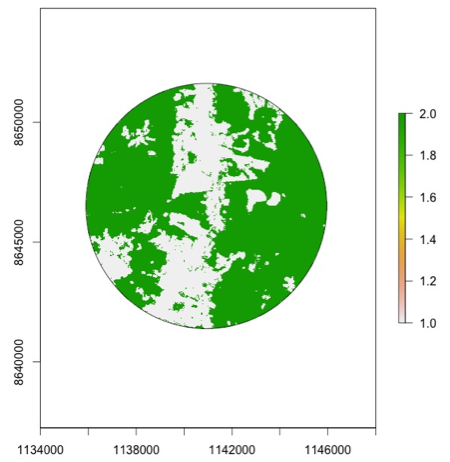
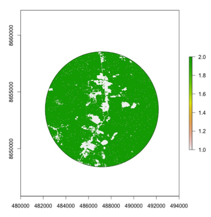

# Download the necessary tools
***

## Necessary Programs

ClimNA - You can download the program and necessary files here: [https://sites.ualberta.ca/~ahamann/data/climatena.html](https://sites.ualberta.ca/~ahamann/data/climatena.html)

If you have a Windows machine, you should be able to simple unzip the folder and run the "ClimateNA_v5.21.exe" file.
However, if you have a Mac (like me), you may require a few other programs to run ClimNA, which is made for Windows. You will need to install [Wine](http://www.winehq.org), which allows you to run Windows apps without installing Windows. I recommend downloading Wine itself from the [winehq website](http://www.winehq.org), but the directions included [here](https://www.davidbaumgold.com/tutorials/wine-mac/#part-1:-install-homebrew) about installing Homebrew and XQuartz, which may be necessary in order to run Wine, are very helpful. Finally, you may need to run the ClimateNA file called “Libraryfiles.exe” in Wine before you are able to run the "ClimateNA_v5.21.exe" file itself.
First, set a folder where you will have shapefiles and images

```{r}
setwd("~/Documents/PhD.Dissertation/Campo2017/Maps&Imagenes/Bosque_No_Bosque_2016_Hib_Raster")
```


#### you will need:
1. intermediate knowledge of R
2. the following packages:

```{r}
library(raster)
library(SDMTools)
library(maptools)
library(rgdal)
```

## Uploading raster files

```{r}
Forest <- raster("Bosque_No_bosque_2016.tif")
```

To know the projection of the raster

```{r}
projection(Forest)
```

To know the resolution of the raster

```{r}
res(Forest)
```

To plot the raster, in this case this is for whole country

```{r}
plot(Forest)
```

## Croping maps
***
Croping the country raster in order to have only the Madre de Dios department

First we generate an object using the UTM coordinates that delimited the study area

```{r}
CorridorMap = extent(1050000, 1190000, 8550000, 8900000)
```

The function "extent" returns an Extent object of the Raster

We use this object to crop the country raster into a small area

```{r}
cropForest <- crop(Forest, CorridorMap)
```

We then plot the small raster

```{r}
plot(cropForest)
```

In order to know how many class categories the raster has we use the function "ClassStat".

The function "ClassStat" calculates the class statistics for patch types identified in a raster.

```{r}
SM.Forest.class<-ClassStat(cropForest)
```

In the example there are 4 classes: 1 - non-forest 2000, 2 - forest 2016, 3 - hydrography, 4 - forest loss 2001-2016

## Reclassification
***
We want to reclassify the raster changing 1 (non-forest 2000), 3 (hydrography), 4 (forest loss 2001-2016) = Non Forest

We create a table with the old and new classes.

```{r}
classification<-matrix(NA, 4,4)
classification[,1]<-c(1,2,3,4)
classification[,2]<-c("NoForest2000","Forest2016","Hidrography","Loss2001-2016")
classification[,3]<-c(1,2,1,1)
classification[,4]<-c("NoForest","Forest","NoForest","NoForest")
colnames(classification)<-c("Landcover","Description","ChangeTo", "Description2")
classification<-as.data.frame(classification)
str(classification)
classification[,1]<-as.numeric(classification[,1])
classification[,3]<-as.numeric(classification[,3])
class<-classification[,c(1,3)]
str(class)
```

### Reclassify the map

The function "reclassify" (re)classifies groups of values to other values.

```{r}
rasterFINAL<-reclassify(cropForest,rcl=class)
```

Ploting the reclassified raster

```{r}
plot(rasterFINAL)
```

Getting the metrics from reclassified raster
```{r}
SM.rasterFINAL.class<-ClassStat(rasterFINAL)
```

## Estimating Forest Cover in specific areas
***

#### Croping raster using shape files

To draw a polygon from a shape file in R, we use as example shape file for a circle of 5km radius surrounding a sampling site in Madre de Dios, Peru

```{r}
Site3.5km = readShapeSpatial("Site3-5km.shp")
```

To know if the projection of the polygon is the same of the raster map

```{r}
projection(Site3.5km)
```

The shape file does not have any projection

To fix this,we first adjust the coordinate system.
Since the shape file was generate under longitude and latitude coordinate system we use that one. We indicate the datum too.

```{r}
Site3.5km = readShapePoly("Site3-5km.shp", proj4string=CRS("+proj=longlat +datum=WGS84"))
```

Note that if  we assign UTM directly, the longitude and latitude coordinates from the shape file will wrongly be considered as UTM.

Check which projection is showing now

```{r}
projection(Site3.5km)
```

In order to have an exact correspondence between the polygon and the raster map, we assigned the coordinate system and projection from the raster to the polygon.

```{r}
spgeo <- spTransform(Site3.5km,CRS("+proj=utm +zone=18 +south +datum=WGS84 +units=m +no_defs +ellps=WGS84 +towgs84=0,0,0"))
```

To be sure that the projection is correct

```{r}
projection(spgeo)
```

We can plot just the polygon to be sure the axes of coordinates are correct

```{r}
plot(spgeo, axes=T)
```

To plot the raster with the polygon

First we plot the raster

```{r}
plot(rasterFINAL)
```

Add the polygon to the raster

```{r}
plot(spgeo, add = T, border="black")
```

To crop and plot the raster in the shape of the polygon

```{r}
rr <- mask(rasterFINAL,spgeo)
plot(rr)
plot(spgeo,add=TRUE)
```



### Total area estimation

To calculate the statistics we need to transform the raster values to matrix type

```{r}
as.matrix(table(values(rr)))
```

```{r}
SM.classSite3.5km<-ClassStat(rr)
```

"total.area" shows the sum of the areas (m2) of all patches of the corresponding patch type.
Total forest area: 60765

To have a better visualization, let's crop the map to a smaller extent creating an object of similar extension to the polygon

```{r}
CorridorMap = extent(1134000, 1148000, 8640000, 8652000)
```

Now, we crop the reclassified raster to the object of similar extension to the polygon size

```{r}
cropSite <- crop(rasterFINAL, CorridorMap)
```

Ploting and drawing the raster inside the object (square)

```{r}
plot(cropSite)
plot(spgeo, add = T, border="black")
```

To crop the raster in the shape of the polygon (circle)

```{r}
rr <- mask(cropSite,spgeo)
plot(rr)
plot(spgeo,add=TRUE)
```


# Working with NDVI
***

Setting the folder

```{r}
setwd("~/Documents/PhD.Dissertation/Campo2017/Maps&Imagenes/Bosque_No_Bosque_2016_Hib_Raster")
```

Load NDVI

```{r}
NDVI <- raster("~/Documents/PhD.Dissertation/Campo2017/Maps&Imagenes/NDVI_20160719.tif")
```

To know the projection of the raster

```{r}
projection(NDVI)
```

To know the resolution of the raster

```{r}
res(NDVI)
```

To plot the raster
In this case this is for whole country (Peru)

```{r}
plot(NDVI)
```

To convert the values into a table

```{r}
as.matrix(table(values(NDVI)))
```

## Reclassify the map
***

We create a table with the old classes and the new classes.

```{r}
classification<-matrix(NA, 256,4)
classification[,1]<-c(0:255)
classification[,2]<-c(rep("NN",256))
classification[,3]<-c(rep(3,4), rep(1,115), rep(2,137))
classification[,4]<-c(rep("NoData",4), rep("NoForest",115), rep("Forest",137))
colnames(classification)<-c("Landcover","Description","ChangeTo", "Description2")
classification<-as.data.frame(classification)
str(classification)
classification[,1]<-as.numeric(as.character(classification[,1]))
classification[,3]<-as.numeric(classification[,3])
class<-classification[,c(1,3)]
str(class)
```

The function "reclassify" (re)classifies groups of values to other values.

```{r}
rasterFINAL<-reclassify(NDVI,rcl=class)
```

Ploting the reclassified raster

```{r}
plot(rasterFINAL)
```

To know the projection of the reclassified raster

```{r}
projection(rasterFINAL)
```

## Estimating Forest Cover in a determined area
***

Repeating the example to estimate the forest cover in a circle of 5km radius surrounding a sampling site.

SITE 3 - 5KM Radii

```{r}
Site.5km = readShapeSpatial("Site3-5km.shp")
projection(Site.5km)
Site.5km = readShapePoly("Site3-5km.shp", proj4string=CRS("+proj=longlat +datum=WGS84"))
projection(Site.5km)
spgeo <- spTransform(Site.5km,CRS("+proj=utm +zone=19 +south +datum=WGS84 +units=m +no_defs +ellps=WGS84 +towgs84=0,0,0"))
projection(spgeo)
plot(spgeo, axes=T)
CorridorMap = extent(480000, 493000, 8648000, 8660000)
cropSite <- crop(rasterFINAL, CorridorMap)
plot(cropSite)
plot(spgeo, add = T, border="black")
rr <- mask(cropSite,spgeo)
plot(rr)
plot(spgeo,add=TRUE)
as.matrix(table(values(rr)))
SM.classSite.5km<-ClassStat(rr)
```

Total.area 2699191




# Moving Window
***

Sources: Fragstats Manual

We also can estimate the forest cover using the moving window approach. The window moves over the landscape one cell at a time, calculating the selected metric within the window and returning that value to the center cell.”(manual de fragstats)

#### you will need:
1. intermediate knowledge of R
2. the following packages:

```{r}
library(raster)
library(SDMTools)
library(rgdal)
```


Upload the raster map
```{r}
rasterSanMartin<-raster("rasterascii_sanmartin.txt", resolution=30)
```

Plot the map

```{r}
plot(rasterSanMartin)
```

Transforming data into table

```{r}
as.matrix(table(values(rasterSanMartin)))
```

To know the classes

```{r}
SM.class<-ClassStat(rasterSanMartin)
SM.class$class
```

##Reclassify

Forest + Secondary vegetation = Forest
Cleared matrix + road = Matrix

We create a table with the old classes and the new classes.

```{r}
classification<-matrix(NA, 4,4)
classification[,1]<-c(0,1,2,3)
classification[,2]<-c("Matrix", "Forest","Secondary vegetation","Road")
classification[,3]<-c(1,2,2,1)
classification[,4]<-c("Matrix","Forest","Forest","Matrix")
colnames(classification)<-c("Landcover","Description","ChangeTo", "Description2")
classification<-as.data.frame(classification)
class<-classification[,c(1,3)]
```

Ploting the reclassified map

```{r}
rasterFINAL<-reclassify(rasterSanMartin,rcl=class)
plot(rasterFINAL)
```

To change the legend values from 1-2, to 0-1

```{r}
forest<-rasterFINAL
values(forest)<-0
forest[rasterFINAL==2]<-1
plot(forest)
```

Plotting points

```{r}
sites<-read.table("matrix.stream.txt",header=TRUE)
plot(forest)
points(sites$Longitude, sites$Latitude, col="black", cex=0.5,pch=19)
```

## Moving window procedure

#### Five cells

Each cell in this raster has 30 m at each side

nc= number of columns, nr=number of rows.

If nc = 5 and nr = 5, the window will have 150 m at each side

```{r}
radio3<-focal(forest,w=matrix(1,nr=5,nc=5))
plot(forest,main="Bosque vs Matrix")
plot(radio3,main="Moving Window")
points(sites$Longitude, sites$Latitude, col="black", cex=0.5,pch=19)
```

To extract the value for the raster in the selected window at each of our points

```{r}
xy<-sites[,c(2:3)]
background.cov3<-extract(x=radio3, y=xy)
```

#### Six cells

```{r}
radio6<-focal(forest,w=matrix(1,nr=11,nc=11))
plot(forest,main="Bosque vs Matrix")
plot(radio6,main="Moving Window")
points(sites$Longitude, sites$Latitude, col="black", cex=0.5,pch=19)
xy<-sites[,c(2:3)]
background.cov6<-extract(x=radio6, y=xy)
```
