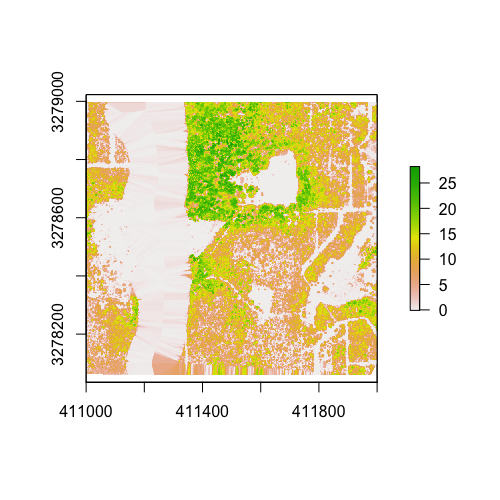

## Crown segmentation and identification with LiDAR and Hiperspectral data

In this module we will learn to use LiDAR and hyperspectral data to automatically extract ecological information about individual trees at landscape scale. 


### Before starting, you will need:
1. Intermediate knowledge of R
2. !Download[] the dataset we'll use for this lesson
3. have the following libraries installed:
  1. `raster`
  2. `rgdal`
  3. `readr`
  4. `dplyr`
  5. `tidyr`
  6. `e1071`
  7. `devtools`
  8. `rlas`
  9. `lidR`
4. We suggest you to have the libraries `rlas` and `lidR` installed from latest version on github. 


#### Delineation from LiDAR module:
- Visualize LiDAR data
- Create a Canopy Height Model (CHM) from point-cloud dataset
- Perform crown delineation using Silva et al., 2016
- Extract and save single crowns data

#### Species classification from hyperspectral module:
- Pre-processing of hyperspectral pixels
- Stratified sampling by species 
- applying a Support Vector Machine (SVM) to the data (the easy way)
- (tuning SVM parameters with 10-fold Cross Validation (10k-CV))
- Crown predictions and confusion proportions

### Some background


### Visualize LiDAR data

First of all, we will need our dataset to play with. You can download it from here https://blablabla.io


```{r}
devtools::install_github("Jean-Romain/rlas", dependencies=TRUE)
devtools::install_github("Jean-Romain/lidR", dependencies=TRUE)
library(rlas)
library(raster)
library(lidR)
library(readr)
library("rgdal")
```

Next step, we want to identify the path of the data to be loaded. In this first section we'll load a LiDAR point-cloud file `.laz`, an hyperspectral image `.tif`, and some ground data tree polygons `.shp`. First, let's point to the path where the data is sitting. 

Then, we'll get the name of the files we are interested to load. To have it automatically done, we'll use the function `list.files`, which returns a character vector, with the name of each single file respecting a defined `pattern`

```{r}
pt <-  "./data/delineation/"
f <- list.files(pt, pattern = ".laz")[1]
f_hps <- list.files(pt, pattern = "hps.tif")[1]
```
In this case we chose to store only the first file name found by `list.files`. That's why we used [1] after the function.

Let's now load a point-cloud dataset, and normalize it. Why are we normalizing? Point cloud data is potentially prone to a lot of noise. That noise can partly be reduced if we reduce squeeze the variance relative to the vertical gradient of the points bouncing back. Fortunately, the `lidR` comes with an handy function, `lasnormalize`, which does it for us:

```{r}
las = readLAS(paste(pt, f, sep=""))
lasnormalize(las, method = "knnidw", k = 10L)
plot(las, color="Intensity", colorPalette = terrain.colors(50), trim=0.95)
```

Now, we can plot our pointcloud data for a cool 3D view!

```{r}
plot(las, color="Intensity", colorPalette = terrain.colors(50), trim=0.95)
```
IMAGE 

Not happy with the color palette? you can actually take advantage of the hyperspectral information to add a cool false color palette to your point-cloud view. Let's see how.
Let's first load our data as a raster stack. Raster stack are way faster than common rasters and allow us to work with rasters with a very high number of bands.We can plot, for example, the combination of band 16, 86 and 177 using 'plotRGB'

```{r}
hps   = stack(paste(pt, f_hps, sep =""))
plotRGB(hps, r=16, g=177, b=86, stretch="lin")
```

IMAGE 

Not bad, right? they seem good enough to color our point cloud pixels. Let's extract and normalize them: 

```{r}
ch1 = image_rgb@layers[[1]]
ch2 = image_rgb@layers[[2]]
ch3 = image_rgb@layers[[3]]
ch1[ch1 >10000] = 0 
ch2[ch2 >10000] = 0 
ch3[ch3 >10000] = 0 
```

Now, let's reclassify three new channels, so that they have the information about the color intensity in our composite RGB

```{r}
lasclassify(las, ch1, "R")
lasclassify(las, ch2, "G")
lasclassify(las, ch3, "B")
las@data <- las@data[!is.na(las@data$R)]
```
And now, the magic! let's colorize our point-cloud with the three channels just realized!

```{r}
lascolor(las)
plot(las, color = "color")

```

### Create a Canopy Height Model 

Now that we have point cloud data we can use that directly to predict crowns shape and position, or we can produce a raster file, to be used to perform crown delineation with other types of algorithms. NEON produces already canopy height models, but of "only" 1m2 resolution. 
Don't you want more? Let's check how to get a 0.5m2 resolution CHM!

```{r}
chm = grid_canopy(las, res = 0.5, subcircle = 0.2, na.fill = "knnidw", k = 4, p = 1)
chm = as.raster(chm)
plot(chm)
```
IMAGE 

Unfortunately, LiDAR point cloud data may be noisy. This can be a problem especially if we go so high resolution. In fact, is a good practice to filter blur the image, just a little, avoiding big artifacts and unnatural crowns

```{r}
kernel = matrix(1,3,3)
chm = raster::focal(chm, w = kernel, fun = mean)
chm = raster::focal(chm, w = kernel, fun = mean)
plot(chm)
```



### Perform crown delineation using Silva et al., 2016

Now, let's try to apply a crown delineation algorithm (Silva et al., 2016). First of all we will need to look for the highest points, which will represent the top of our trees. Let's look at what are the parameters involved:

```{r}
?tree_detection
ttops = tree_detection(chm, 5, 2)
```

5 and 2 seem a reasonable way to go, for this case. At this point we can predict our crowns' shape!

```{r}
crowns <-lastrees_silva(las, chm, ttops, max_cr_factor = 0.6, exclusion = 0.3, extra = T)
plot(crowns)
```


